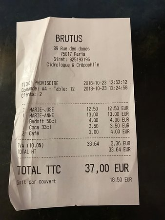
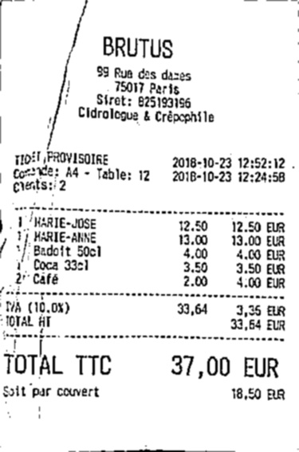
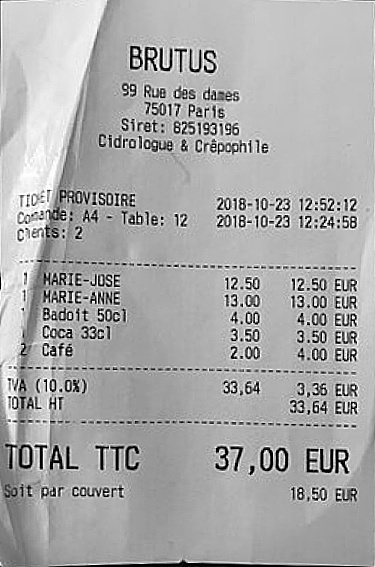

# Automatic Document Scanner

## Example
#### input

#### output

## How To Use
- put images in "input" directory
- run "DocumentScanner.py"
- the scanned images are in the "output" directory

## Process

